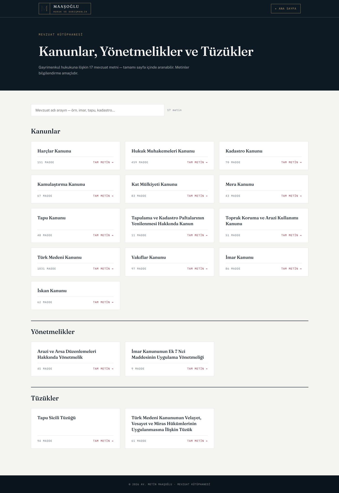
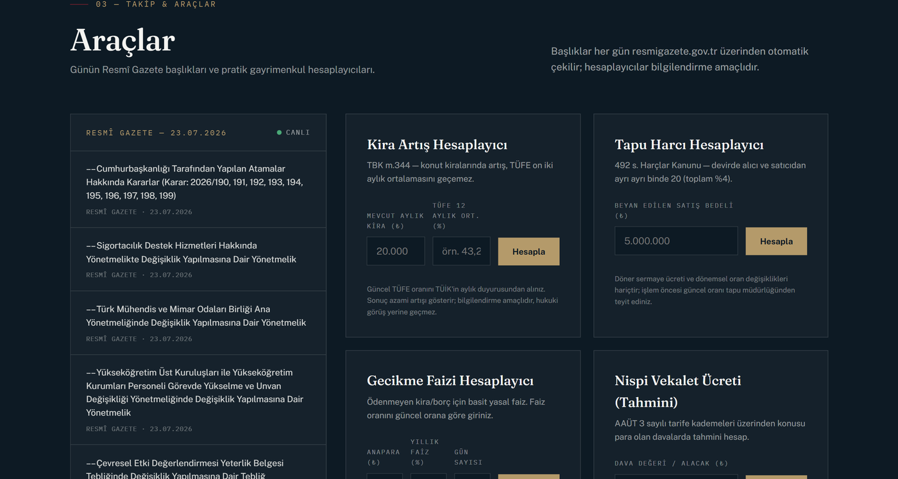
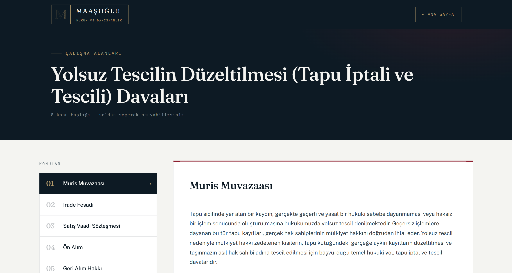

# Titulus

**A production website for a real-estate law practice, built so the lawyer never has to call a developer to change anything.**

[](https://www.avukatmetinmaasoglu.com)


*Titulus* — the Roman-law term for the document that establishes ownership of land. The
practice this was built for works exclusively in real-estate law, where nearly every dispute
comes back to what the register says and whether it says it lawfully.

A real client project, live and in daily use. It replaced a WordPress installation the
practice could no longer maintain, and it carries a legislation library of **2,468 articles
across 17 statutes**, a live feed of the Turkish Official Gazette, five property-law
calculators, and an admin panel that lets a non-technical user publish and edit all of it.


---

## The brief

The client works only in real-estate law. He had two problems with the site he had:

1. **Every content change needed a developer.** A new announcement, a corrected paragraph, a
   new practice area — all of it went through someone else, on someone else's timetable.
2. **The site did nothing for him.** It described the practice. It did not answer the
   questions people actually search for, and gave him nothing to point a client at during a
   phone call.

So the goal was not a nicer website. It was: *the lawyer edits everything himself, and the
site becomes a working reference rather than a brochure.*

---

## What it does

### A legislation library, article by article



Seventeen statutes, regulations and by-laws — parsed out of a WordPress XML export into
article-level markup. 2,468 articles in total, from the Civil Code's 1,031 down to the 11
articles of the cadastral map renewal act. Every text is its own page with its own title,
meta description and canonical URL. The index filters live as you type, using
`toLocaleLowerCase('tr')` so that *İmar* and *imar* match — the dotted capital İ is a real
trap in Turkish, and the default lowercase mapping gets it wrong.

This is the part of the site that earns its keep. People do not search for a law firm. They
search for a provision, find the text, and then look for whoever published it.

### A live Official Gazette feed



`rg.php` fetches the day's headlines from resmigazete.gov.tr, extracts them with a pattern
that tolerates both relative and absolute link forms, discards navigation noise by title
length, de-duplicates, and caches to disk for six hours. If the source is unreachable the
panel shows a plainly worded notice — it never presents stale entries as today's.

There is a `?debug=1` mode reporting the HTTP status, the response size and the match count,
with a note on how to read the combination. That endpoint exists because the source is a
government site that changes its markup without warning, and when it does, the person
debugging it will not be me.

### Five calculators

Rent increase (Code of Obligations art. 344, capped at the twelve-month CPI average), title
deed fee (Fees Act no. 492, 2‰ from each side), late-payment interest, the proportional
attorney fee scale, and advance court fee. Each states the provision it implements and
carries a notice that it is informational. Figures that change annually — the CPI, the fee
tariff — are marked as such in the interface rather than quietly going out of date.

### An admin panel for a non-developer



`panel.php` is a single-file admin with tabs for announcements, the legislation library,
practice areas and settings. There is no database. Content lives in JSON; generated
legislation pages are written to disk as static HTML.

The piece I am most pleased with is the subheading system. The lawyer types plain text into a
textarea. A blank line starts a paragraph. A line beginning with `§§` becomes a styled
subheading, and a button inserts the prefix for him. He never sees HTML, never breaks the
layout, and every practice area keeps the same structure — which is exactly what a WYSIWYG
editor would have undone within a month.

---

## Security

This guards a live site owned by someone else, so the decisions are worth stating:

| Concern | How it is handled |
| --- | --- |
| Credentials | `password_hash` / `password_verify` (bcrypt). The hash lives in a JSON file that `.htaccess` denies to the web, and is changed from the panel itself |
| Password change | Written, then read back and re-verified before reporting success — a failed write on shared hosting must not look like a successful one |
| Brute force | Five failed attempts per hashed IP, then a fifteen-minute lockout |
| Session | `httponly`, `samesite=Lax`, and `secure` whenever the request arrived over HTTPS |
| Request forgery | A per-session token required on every mutating POST; a mismatch returns 403 and stops |
| Stored XSS | `strip_tags` and length caps on the way in, `htmlspecialchars` on the way out |
| Path traversal | Slugs must match `^[a-z0-9][a-z0-9-]*$` and stay under 120 characters before they can ever build a filename — checked on create, edit and delete |
| Slug collisions | Duplicates are suffixed automatically instead of overwriting an existing page |
| Concurrent writes | Every JSON and HTML write takes `LOCK_EX` |
| Data exposure | `.htaccess` denies every `.json` file and every dotfile; directory listing is off |
| Response headers | CSP, `X-Content-Type-Options`, `X-Frame-Options`, `Referrer-Policy`, `Permissions-Policy` |
| Contact spam | A honeypot swallowed silently rather than rejected, plus three submissions per ten minutes per IP |
| Email header injection | Newlines stripped from every field before it reaches the mail headers |
| Privacy | Rate limiting keys on a SHA-256 of the IP, never the address itself. A data-protection notice covers the form, and consent is enforced server-side, not just in the browser |

The Turkish Bar Association's advertising rules also constrain what a law firm's site may
say. The copy was written to that constraint, and the footer states it.

---

## Architecture

```
index.php              Home: practice areas, legislation index, tools, FAQ, contact
alan.php?a=<slug>      One practice area, rendered from alanlar.json
mevzuat/index.php      Legislation index — 17 texts, live filter
mevzuat/<slug>.html    One statute, article by article (generated by the panel)
rg.php                 Official Gazette bridge — fetch, parse, 6-hour disk cache
iletisim.php           Contact handler — honeypot, consent, rate limit, mail
panel.php              Admin: announcements · legislation · practice areas · settings
404.html · kvkk.html   Error page and data-protection notice
.htaccess              Headers, denials, redirects, cache policy
robots.txt · sitemap.xml

alanlar.json           Practice areas and their topic sections
mevzuat.json           Legislation index metadata
duyurular.json         Announcements
panel_sifre.json       Password hash        ─┐
panel_giris.json       Failed-login records  ├─ all denied to the web
iletisim_limit.json    Rate-limit window     │
rg_cache.json          Official Gazette cache┘
```

**Why no database.** A few hundred records, changed a few times a month, by one person. A
database would have added a dependency, a backup obligation and a migration path, and bought
nothing. JSON files with `LOCK_EX` writes say the same thing more simply. If the practice
ever has multiple editors this is the first decision to revisit — and it is a small revision.

**Why generated static HTML for the statutes.** A statute changes rarely and is read often.
Rendering 1,031 articles through PHP on every request to produce identical bytes is work for
nothing. The panel generates the page once at edit time; the server then hands over a flat
file.

**Why no framework.** The site has to stay maintainable on shared hosting with no deployment
pipeline, by whoever comes after me. A build step would have been the first thing to rot.

---

## Stack

PHP 8 · vanilla JavaScript, no framework and no build step · JSON as the data layer · cURL
for the Official Gazette bridge · Apache on shared hosting.

Type: Fraunces (display), Public Sans (body), IBM Plex Mono (labels).
Palette: petrol navy `#0D1A24`, cream `#F4F4F1`, claret `#8E1F2F`, bronze `#B49A6A`.

---

## What I would change next

- **Mail delivery.** `mail()` on shared hosting is at the mercy of the receiving server's
  spam policy. A transactional mail API with proper SPF and DKIM records is the correct
  answer, and it is the next change I would make.
- **Single-editor assumption.** Two people editing one practice area at the same time would
  get last-write-wins. Fine for one user; not fine for three.
- **Search depth.** The library filters titles, not article text. Full-text search across all
  2,468 articles is the obvious next feature, and the content is already structured for it.

---

## Scope

The source is private: it runs a live site holding a working practice's content and its
contact routing. This README, the screenshots and the site itself are the public record.

---

## Author

Built by **Nisa Maaşoğlu**, Software Engineer — [github.com/nisamaasoglu](https://github.com/nisamaasoglu).
Source code available on request.
